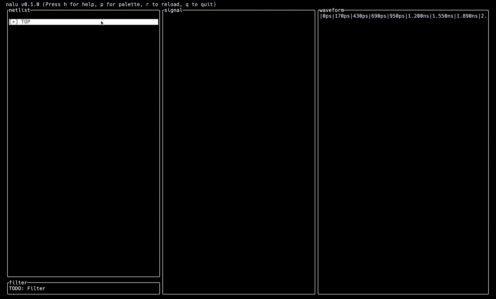

# Nalu

[![crates.io][crates-badge]][crates-url]
[![docs.rs][docs-badge]][docs-url]
[![MIT licensed][mit-badge]][mit-url]
[](https://github.com/dagronlund/nalu)

[crates-badge]: https://img.shields.io/crates/v/nalu.svg
[crates-url]: https://crates.io/crates/nalu
[docs-badge]: https://docs.rs/nalu/badge.svg
[docs-url]: https://docs.rs/nalu
[mit-badge]: https://img.shields.io/badge/license-MIT-blue.svg
[mit-url]: https://github.com/dagronlund/nalu/blob/master/LICENSE

A high-performance, terminal-native waveform browser with python scripting.



## Usage

The waveform viewer is usable with either the keyboard, or both the mouse and keyboard. Nalu is divided into separate panes, each of which can either be partially selected or fully selected. Panes that are highlighted in yellow are partially selected, and you can navigate to other panes with the arrow keys. A pane can be fully selected by pressing enter, and then partially selected again by pressing escape.

## Scripting

Python scripting is used to save waveform configuration as well as displaying dynamic waveform content. In GTKWave a similar function is provided by .gtkw files. Nalu will default to using `<name>.py` as the waveform configuration file when opening `<folder>/<name>.vcd`, but different configuration files can be given with `--config <name>.py`. Keep in mind, this file can be modified by Nalu when saving configurations, so be aware of unsaved changes in an editor. When generated by Nalu, the config file should look like this:

```python
"""Nalu config script"""

from nalu import new_group, new_vector, new_signal, new_spacer, SignalRadix


### BEGIN NALU GENERATED CODE ###
# fmt: off
def nalu_config(vcd_header):
    """Nalu generated waveform config"""
    return []
# fmt: on
### END NALU GENERATED CODE ###


def user_config(vcd_header):
    """User generated waveform config"""
    # Add user-defined signal config here
    return []


def interactive(buffer, waveform, vcd_header, cursor):
    """Custom waveform visualization/interaction"""
    return

```

Avoid modifying anything between the `### NALU GENERATED CODE ###` comments, since if that block is modified or removed, then nalu cannot save the waveform configuration changes made in the TUI. Complex user interactivity is provided by the `interactive()` function, but it is advisable to call to another python file from inside of it. This reduces the chances of modifying this file at the same time as Nalu.

